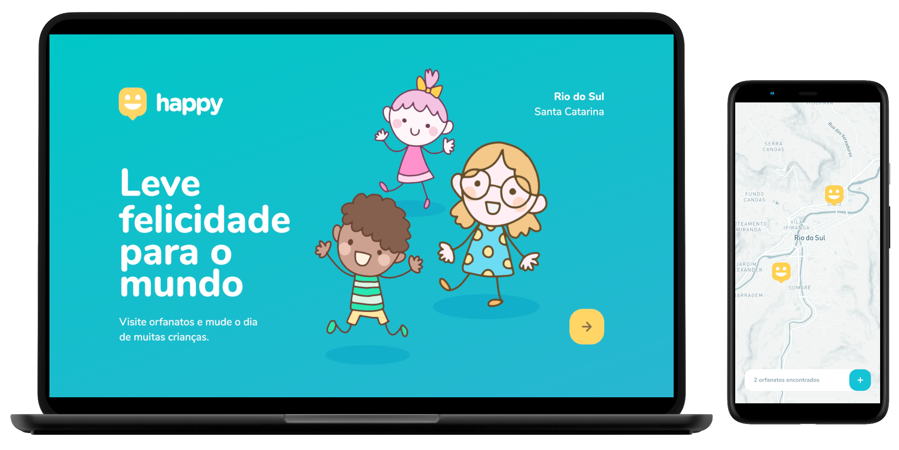

<h1 align="center">
    
</h1>

<p align="center">
  <a href="#-tecnologias">Tecnologias</a>&nbsp;&nbsp;&nbsp;|&nbsp;&nbsp;&nbsp;
  <a href="#-começando">Começando</a>&nbsp;&nbsp;&nbsp;|&nbsp;&nbsp;&nbsp;
  <a href="#-projeto">Projeto</a>&nbsp;&nbsp;&nbsp;|&nbsp;&nbsp;&nbsp;
  <a href="#-layout">Layout</a>&nbsp;&nbsp;&nbsp;|&nbsp;&nbsp;&nbsp;
  <a href="#-license">Licença</a>
</p>

<p align="center">
  
  
  

  
</p>

<br>

<p align="center">
  
</p>

---

## 🧪 Tecnologias 🚀

Este projeto foi desenvolvido utilizando as seguintes tecnologias:

- [Node.js](https://nodejs.org/en/)
- [ReactJS](https://reactjs.org/)
- [React Native](https://reactnative.dev/)
- [TypeScript](https://www.typescriptlang.org/)
- [Expo](https://expo.io/)
- [Express](https://expressjs.com/pt-br/)
- [TypeORM](https://typeorm.io/#/)
- [Yup](https://github.com/jquense/yup)
- [Axios](https://github.com/axios/axios)
- [React Router DOM](https://reacttraining.com/react-router/)
- [React Navigation](https://reactnavigation.org/)

## 🚀 Começando

Clone o projeto e acesse a pasta

```bash
$ git clone https://github.com/henrique-brites/Happy.git && cd Happy
```

Siga os passos abaixo

### Backend

```bash
# Começando na pasta raiz do projeto, vá para a pasta backend 
$ cd backend

# Instale as dependências 
$ yarn

# Use o script para executar as migrações
$ yarn typeorm migration:run

# Para terminar, execute o serviço api
$ yarn dev

# Muito bem, o projeto foi iniciado!
```

### Web

_Obs.: Antes de continuar, certifique-se de ter a API em execução_ 

```bash
# Começando na pasta raiz do projeto, vá para a pasta da web
$ cd web

# Instale as dependências
$ yarn
```
Para executar o projeto **web** completo é necessário ter um **token** de autenticação da API do Mapbox e a url da api. Acesse sua conta no site e crie um token para ser utilizado no projeto. Com o token em mãos, copie o arquivo `.env.exemple` para `.env` e coloque seu token como valor da chave `REACT_APP_MAPBOX_TOKEN` e a url da api `REACT_APP_BASE_URL`.

_No entanto, se você não quiser ter este trabalho com o Mapbox, sem problemas, por padrão já tem um mapa configurado para uso._

Exemplo:

```text
REACT_APP_MAPBOX_TOKEN=xxxxxxxxxxxxxxxxxxxxxx
REACT_APP_BASE_URL=http://xxx.xxx.xxx.xxx:3333
```

```bash
# Inicie o cliente
$ yarn start
```

### Mobile

_Obs.: Antes de continuar, certifique-se de ter a API em execução_ 

```bash
# Começando na pasta raiz do projeto, vá para a pasta mobile 
$ cd mobile

# Certifique-se de que o arquivo 'src/services/api.ts' tem a URL para sua API

# Inicie o serviço Expo e escaneie o código QR com o Expo Client
$ yarn start
```

## 💻 Projeto

**Happy** é uma plataforma para conectar instituições de cuidados infantis com pessoas interessadas em ajudar.

Este é um projeto desenvolvido durante a **[Next Level Week](https://nextlevelweek.com/)**, apresentado por **[@Rocketseat](https://github.com/Rocketseat)**.

## 🔖 Layout

Nos links abaixo você encontra o layout do projeto web e também do mobile.

- [Layout Web](https://www.figma.com/file/mDEbnoojksG4w8sOxmudh3/Happy-Web)
- [Layout Mobile](https://www.figma.com/file/X27FfVxAgy9f5IFa7ONlph/Happy-Mobile)


Lembrando que você precisa ter uma conta no [Figma](http://figma.com/) para acessá-lo.

## 📝 License

Este projeto está licenciado sob a Licença MIT. Veja o [LICENSE](LICENSE) para detalhes.

Feito com 💜 por [Henrique Brites](https://github.com/henrique-brites) 👋